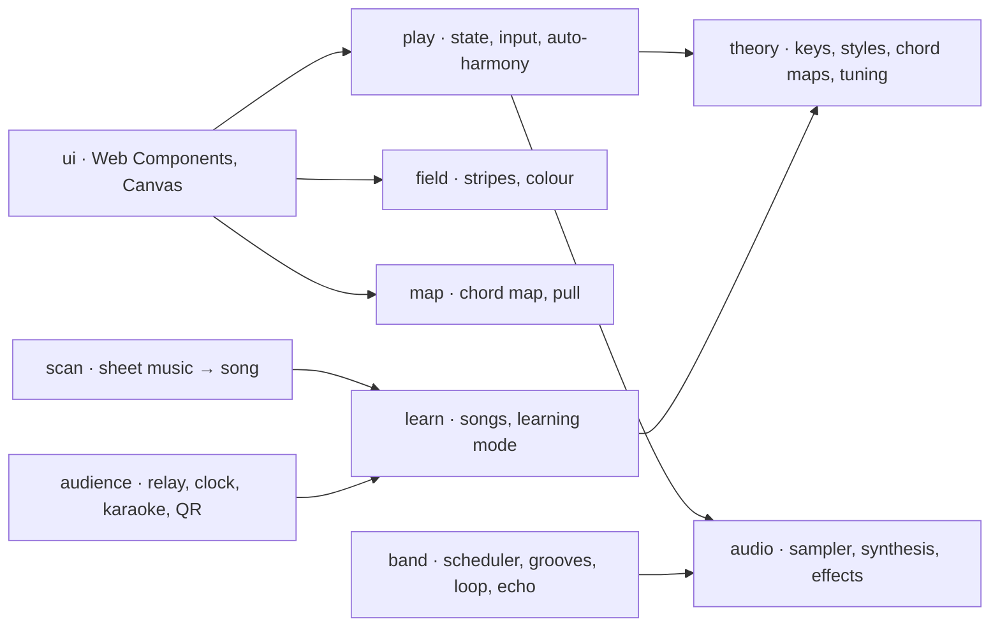

# Wumble

A harmonic playing field in the browser: one hand holds the chord, the other plays the tones – and the width of every
stripe tells you how well it fits.

## Playing it

Open the link, or download `wumble.html` from a [release](https://github.com/bartfastiel/wumble/releases) and
double-click it – everything, samples included, is in that one file.

**Left hand: the chord map.** One spot per chord of the style. Vertical is pull: what lies above leads home, what lies
below leads away from it; side by side stand substitutes that colour the same job differently. A spot grows the more
likely it is to come next. A tap chooses, and the chord keeps sounding until another one is chosen – nothing needs
holding. The large grey spot is silence: melody without accompaniment.

**Right hand: the field of stripes.** One stripe per tone of the key, low at the bottom left, high at the top right,
across eight octaves. Against the chord that sounds, every stripe grows as wide as its tone carries: wide and warm for
the root and the fifth, narrower for the third, narrow and cool for a tone that wants to move on. Nothing is ever
blocked – you can play any tone, you just hit the carrying ones more easily. Sliding gives a glissando, several fingers
play several voices, and holding a tone shapes it: further in brightens, a small circle makes it waver.

**And the rest.** The **keyboard** plays along – the two letter rows are fifteen tones around the middle of the field,
the digits choose a chord. **Band** (🥁) adds drums, bass and chords in the groove of the style; ● records a loop from
the next bar, the settings offer schemata, tap tempo, echo and radio. **Songs** (♫) show the next tone as a glowing
dot, with levels that score the hits. **Scan sheet music** photographs a printed melody and lays it on the field.
**Audience** opens a room with a QR code: friends see the lyrics scroll on their phone like karaoke and applaud.
Settings switch key, style, tuning, sound and labels; the URL fragment carries them as a shareable link.

## Development

Node 24, `npm ci`, then:

| Script                      | Purpose                                                                          |
| --------------------------- | -------------------------------------------------------------------------------- |
| `npm run dev`               | Dev server (Vite)                                                                |
| `npm run build` / `preview` | Production build to `dist/` and a local preview of it                            |
| `npm run lint` / `lint:fix` | ESLint (typescript-eslint strict, SonarJS)                                       |
| `npm run format`            | Prettier                                                                         |
| `npm run typecheck`         | `tsc --noEmit`                                                                   |
| `npm test` / `test:watch`   | Vitest with coverage (threshold 90 % for `src/**` except `src/ui/**`)            |
| `npm run e2e`               | Playwright (Chromium, WebKit) against an e2e build, then the e2e coverage report |
| `npm run size`              | Size budget: `dist/assets/*.js` together ≤ 120 kB gzip                           |
| `npm run single-file`       | Single file `dist/wumble.html` for double-click use                              |
| `npm run check`             | lint + typecheck + test + build + size                                           |

Git hooks (`.githooks/`, enabled by `npm ci`): lint, typecheck and unit tests before each commit; commit messages follow
[Conventional Commits](https://www.conventionalcommits.org/) (`feat|fix|docs|test|refactor|chore|ci(scope)?: …`).
The audience needs the relay: `npm run build:relay && node dist/relay/relay.mjs` (port 8765) for a local page, in
production it runs next to the site behind `/ws`.

## Architecture

Pure modules below, thin components above, no runtime dependencies. The whole playing surface is one canvas with one
draw call per frame. The single file `dist/wumble.html` is a second build output of the same sources. The e2e build
(`vite build --mode e2e`) exposes the app as `window.__wumble` for Playwright; the production build does not. Golden
reference values live in `src/**/__fixtures__`.

## Quality

Logic lives in pure TypeScript modules without DOM or audio (theory, tuning, harmonization, scheduler, scan, QR, clock
sync) and is covered at least 90 % by Vitest; the UI is thin and tested end-to-end with Playwright in Chromium and
WebKit. The coverage on SonarCloud counts unit (Vitest) and e2e (Playwright, Chromium) coverage together, so the UI
is in the number. TypeScript strict, ESLint with Sonar rules and Prettier run in git hooks and in the pipeline;
SonarCloud keeps the quality gate (zero findings, duplicates only in data tables). Every PR is built, tested, checked
against a size budget and deployed as a preview; merging needs green checks, an up-to-date `main` and one approval.
Dependabot keeps the dev dependencies current – there are none at runtime. Decisions are ADRs in
[docs/adr](docs/adr), the rules are in [CONTRIBUTING.md](CONTRIBUTING.md).

## Sounds and licenses

The sampler uses royalty-free recordings only:

- **Salamander Grand Piano V3** by Alexander Holm, [CC BY 3.0](https://creativecommons.org/licenses/by/3.0/),
  source: [sfzinstruments/SalamanderGrandPiano](https://github.com/sfzinstruments/SalamanderGrandPiano) – piano.
- **VSCO 2 Community Edition** by Versilian Studios (Sam Gossner, Simon Dalzell),
  [CC0](https://creativecommons.org/publicdomain/zero/1.0/), source: [sgossner/VSCO-2-CE](https://github.com/sgossner/VSCO-2-CE)
  – solo violin, violin section, solo double bass and church organ "Rode" (sampled by Simon Dalzell / Ivy Audio).

Melodies and lyrics are traditional or by composers who died before 1925; every one of them is checked against a score
and, programmatically, against the scale and range of its style.

## Deployment

Every push to `main` puts `dist/` (with the relay) on the server as production. Every pull request gets a preview
`pr-<nr>/` (link in the PR comment and as an environment) that disappears when the PR is closed. Production and
previews live under separate paths; the production path stays secret. A tag `v*` creates a GitHub release with the
single file `wumble.html`.
